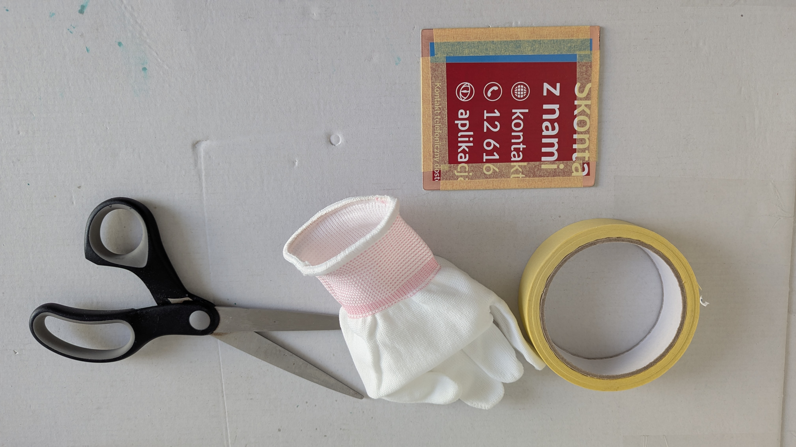
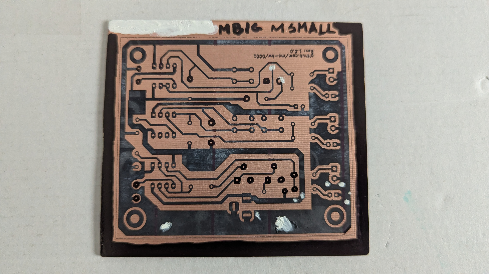
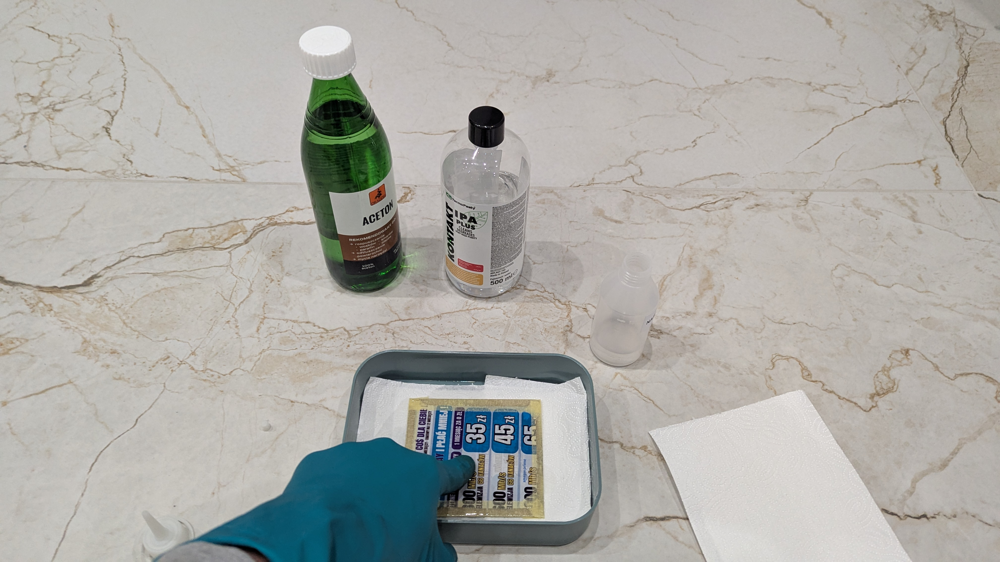
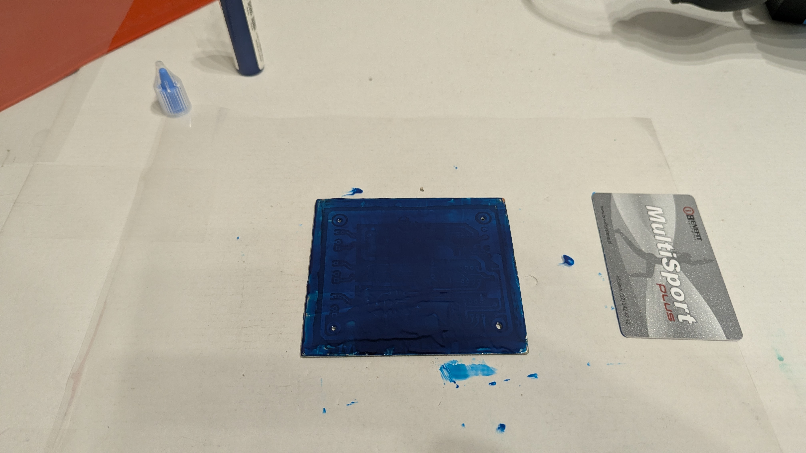

# 555-based latches (0001)

## Description

The circuit contains of three latches: astable, monostable and bistable. Each of them is built around a separate 555
integrated circuit with configurable parameters.

The astable latch is built around integrated circuit U1. Potentiometers RV1 and RV2, together with resistors R1, R2
and capacitor C1 regulate the frequency and duty cycle of the `ASTBL_OUT` output signal according to
[555 Timer Calculator](https://www.build-electronic-circuits.com/circuit-calculator-conversion/555-timer-calculator/).
The frequency range is 1Hz-1kHz. The `ASTBL_OUT` signal is provided to screw connector J2. The state of `ASTBL_OUT`
signal is visualised with D1 LED.

The bistable latch is build around integrated circuit U2. Pushing SW1 button triggers high output state of `BSTBL_OUT`
signal. Pushing SW2 button triggers low output state of `BSTBL_OUT` signal. The `BSTBL_OUT` signal is provided to screw
connector J3. The state of `BSTBL_OUT` signal is visualised with D2 LED.

The monostable latch is build around integrated circuit U3. Potentiometer RV3, together with resistor R6 and capacitor
C4 regulate the pulse duration of the `MSTBL_OUT` output signal according to
[555 Timer Calculator](https://www.build-electronic-circuits.com/circuit-calculator-conversion/555-timer-calculator/).
The pulse is triggered by pushing SW3 button. The pulse duration range is 25ms-25s. The `MSTBL_OUT` signal is provided
to screw connector J4. The state of `MSTBL_OUT` signal is visualised with D3 LED.

The maximal output current of each output signal is ~15mA (input voltage/1000).

## Assembly

The circuit should be assembled on a single-sided, THT printed circuit board.

## Running

The device should be powered with 5-15VDC provided to J1 `DC_IN` (center-positive DC jack 2.1/5.5).

After providing the voltage all output signals should be available (observe LED visualisations).

## Bill of Materials

| Reference            | Qty | Value     |
|----------------------|-----|-----------|
| C1                   | 1   | 470nF     |
| C2,C3,C5             | 3   | 10nF      |
| C4                   | 1   | 22uF      |
| D1                   | 1   | RED       |
| D2                   | 1   | GREEN     |
| D3                   | 1   | YELLOW    |
| J1                   | 1   | DC_IN     |
| J2                   | 1   | ASTBL_OUT |
| J3                   | 1   | BSTBL_OUT |
| J4                   | 1   | MSTBL_OUT |
| R1,R2,R6,R7,R8,R9    | 6   | 1k        |
| R3,R4,R5,R10,R11,R12 | 6   | 10k       |
| RV1,RV2,RV3          | 3   | 1M        |
| SW1,SW2,SW3          | 3   | SW_Push   |
| U1,U2,U3             | 3   | NE555P    |

## References

- [555 Timer Tutorial](https://www.build-electronic-circuits.com/555-timer/)
- [555 Timer Calculator](https://www.build-electronic-circuits.com/circuit-calculator-conversion/555-timer-calculator/)
- [KiCad Schematic Editor documentation](https://docs.kicad.org/9.0/en/eeschema/eeschema.html)
- [KiCad YouTube tutorial 1](https://youtube.com/playlist?list=PL3bNyZYHcRSUhUXUt51W6nKvxx2ORvUQB&si=8JaQM5K1sOJ2W4WG)
- [KiCad YouTube tutorial 2](https://youtube.com/playlist?list=PLEBQazB0HUyQ5YJSdCBb79orXaR3Uk5vm&si=labIkKh_z3xuK7w0)
- [KiCad YouTube tutorial 3](https://www.youtube.com/playlist?list=PLUOaI24LpvQPls1Ru_qECJrENwzD7XImd)
- Preparing PCBs using thermotransfer (Youtube [PL]):
    - [1](https://www.youtube.com/watch?v=IV76AiosMgo)
    - [2](https://www.youtube.com/watch?v=NjvKmZZtHUM)
    - [3](https://www.youtube.com/watch?v=1L4GrPDR9TE) - great effect
    - [4](https://www.youtube.com/watch?v=EEXGR3g5FFA) - interesting way of positioning chalk paper
    - [5](https://www.youtube.com/watch?v=SyNOZ-EPTKQ) - interesting drill technique
    - [6](https://www.youtube.com/watch?v=qdos-b2LzrI)
- Preparing PCBs using chemotransfer (Youtube):
    - [1](https://www.youtube.com/watch?v=XGvP0mEEXu8) - Interesting method with acetone/alcohol transfer
    - [2](https://www.youtube.com/watch?v=cVhSCEPINpM&t=17s) - Interesting method with polish remover transfer

## Implementation

### Breadboard testing

Circuits were tested using breadboard before assembly. Each latch was tested separately.

Testing site:

555 integrated circuit in the bread board:

Minimal astable latch configuration resistance measurement:

Maximal astable latch configuration resistance measurement:

Astable latch testing circuit ready:

Last astable latch continuity testing before providing power:

Astable latch maximal frequency measurement:

Astable latch minimal frequency measurement:

Astable latch maximal current measurement:

Bistable latch testing:

Monostable latch testing:

### PCB preparation

One of the goals of this project was comparing and testing different techniques of preparing printed circuit boards,
including:

- Traces printouts
    - Paper from magazine
    - Chalk paper 115g/m2
    - Transparent film
    - Photo paper
    - Paper dedicated for thermotransfer
- Cleaning the surface
    - Cleaning milk
    - Sandpaper (1000)
    - Isopropanol
    - Nitro
    - Acetone
- Transferring traces
    - Chemotransfer, using Moisturising polish remover (containing acetone)
    - Chemotransfer, using Acetone/Isopropanol 30/70
    - Thermotransfer, using iron, 2.5 dots/~200 degrees Celsius
    - Thermotransfer, using laminator
- Removing chalk paper
    - In the water
    - In the warm water with few drops of dish soap
    - In the warm water with washing powder
    - In the water with vinegar (30%)
    - Damp sponge
    - Toothbrush (probably at the end of one of the process above)
- Fixing broken paths
    - Permanent marker
    - Corrector
- Etching
    - NaSO (B327) (laying PCB on the top of the surface)
    - NaSO (B327) (sinking PCB and moving the container)
    - NaSO (B327) (hanging PCB from the top into the etcher)
    - NaSO (B327) (50 degrees Celsius)
    - FeCl
- Removing tonner
    - Nitro
    - Sandpaper (2000)
    - Cleaning milk
    - Acetone
    - Damp sponge
- Copper protection
    - Solder mask Mechanik
    - Solder mask Relief
    - Tine
    - Colophony dissolved in nitro
    - Nothing
- Solder mask removal from fields
    - Film stencil placed on top during solder mask UV hardening
    - Scraping
- Drills
    - Before etching
    - After solder mask application
    - After tinning
- Silk screen (application/transfer methods the same as for traces)
    - Under solder mask
    - On top of solder mask
- Protecting from oxidising
    - Sinking in methylated spirits (denaturat)
    - Colophony dissolved in nitro
    - Nothing

#### Mark 1

The printout for the first instance of PCB was printed on the page from magazine.

The surface was prepared for transfer using cleaning milk, sand paper (1000, wet) and isopropanol.

Next the printout was stuck to the copper using paper tape and doused with Moisturising polish remover.

The remaining of paper was removed in warm water with dish soup

The result was far from perfect, so the decision was to start again. 
The traces were removed using nitro:

### Mark 2

The traces were printed on the glossy side of thermotransfer paper. Unfortunately, the result was bad. Another try was 
printing on the magazine page, this time more glossy.
**For the future, in KiCad print dialog, try 'Drill Marks: Small mark'.**

The surface was again cleaned with Acetone.

The printout was fine cut this time and stuck to the surface.

The paths were transferred using Moisturising polish remover again.

The paper did not come out easily, so it was put into warm water with dish soap.

The traces required corrections, which were done using corrector and permanent marker.

The etcher was prepared according to instructions.

PCB was etched in 50 degrees Celsius.

Toner was removed with Nitro.

The drilling of mounting points was performed using hand drill. **For the future: table drill is a must.**

The front side of PCB was skimmed with Isopropanol.

The silk screen was printed on the glossy leaflet and aligned to the mounting point holes.

The silk screen was transferred using Acetone/Isopropanol solution (50/50).

The result was miserable, so the layer was removed with Acetone.

Another try was printing on the magazine page (the same as for back side, Mk2). The following layers were printed: 
F.Silkscreen, User.Comments (for mounting points visibility), Edge.Cuts, F.Courtyard). 

The silkscreen was transferred using Moisturising polish remover. The result was OK, but not perfect.

The PCB was skimmed using Isopropanol and dried with hot air before solder mask application.

The solder mask was applied using plastic card.

The F.Mask layer with 'No drill mark' option was used as a stencil. **For the future: Place printed side of the stencil 
up. 2 hours could be too long (mask was hard even under the stencil). Use matt film.**

The solder mask was hardened using UV diode light (~2h).

## PCB ordering

Gerber files should be generated for each PCB manufacturer individually, every manufacturer have a different
requirements for Gerber files. There is no general solution which could be generated upfront for each manufacturer.

Only manufacturers, who allow initiating orders using Gerber/KiCAD files were selected.

Considered manufacturers:

- [Satland Prototype (pl)](https://www.prototypy.com/sites_pcbplugins/pcborder/58)
- [Laskar (pl)](https://laskar.com.pl/): Minimal order - 20 dm2, PLN 365 net for single-sided board.
- [Margol (pl)](https://www.fabrykapcb.pl/index.html)
- [EMS Electronix (pl)](https://www.ems-elektronix.com/zapytania-ofertowe/#formularz-ofertowy)
- [ts (pl)](https://tspcb.pl/zamow-wycen/)
- [PCB Way (ch)](https://www.pcbway.com/)
- [multi-cb (de)](https://portal.multi-circuit-boards.eu/)

