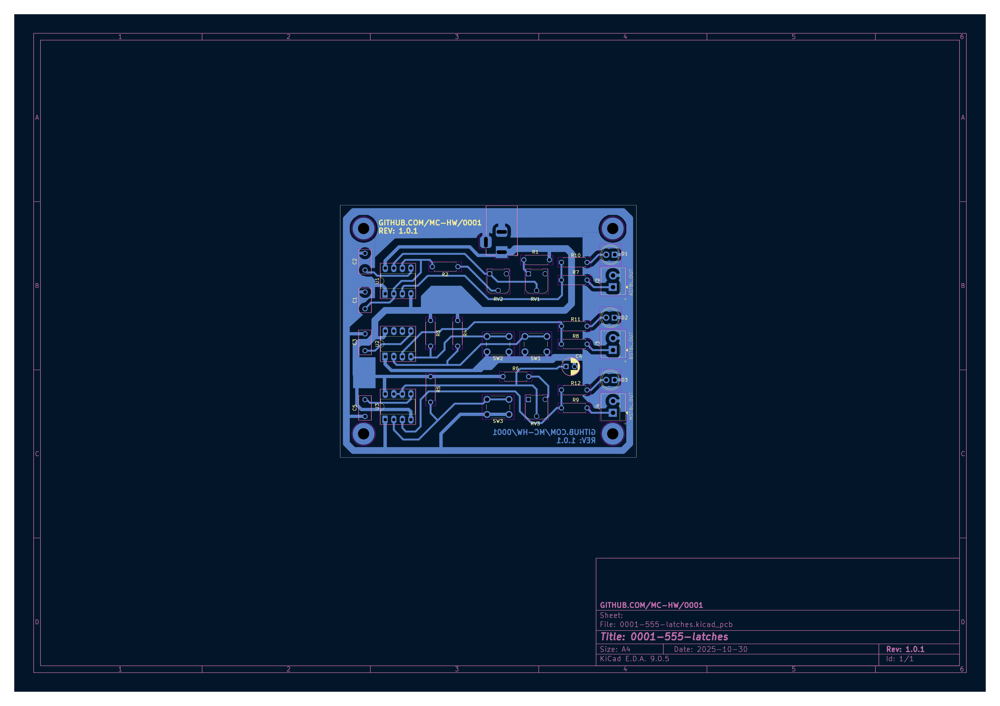

# 555-based latches (0001)

## Description

The circuit contains of three latches: astable, monostable and bistable. Each of them is build around a separate 555
integrated circuit with configurable parameters.

The astable latch is built around integrated circuit U1. Potentiometers RV1 and RV2, together with resistors R1 and R2
and capacitor C1 regulate the frequency and duty cycle of the `ASTBL_OUT` output signal according to
[555 Timer Calculator](https://www.build-electronic-circuits.com/circuit-calculator-conversion/555-timer-calculator/).
The frequency range is 1Hz-1kHz. The `ASTBL_OUT` signal is provided to screw connector J2. The state of `ASTBL_OUT`
signal is visualised with D1 LED.

The bistable latch is build around integrated circuit U2. Pushing SW1 button triggers high output state of `BSTBL_OUT`
signal. Pushing SW2 button triggers low output state of `BSTBL_OUT` signal. The `BSTBL_OUT` signal is provided to screw
connector J3. The state of `BSTBL_OUT` signal is visualised with D2 LED.

The monostable latch is build around integrated circuit U3. Potentiometer RV3, together with resistor R6 and capacitor
C4 regulate the pulse duration of the `MSTBL_OUT` output signal according to
[555 Timer Calculator](https://www.build-electronic-circuits.com/circuit-calculator-conversion/555-timer-calculator/).
The pulse is triggered by pushing SW3 button. The pulse duration range is 25ms-25s. The `MSTBL_OUT` signal is provided
to screw connector J4. The state of `MSTBL_OUT` signal is visualised with D3 LED.

The maximum output current of each output signal is ~15mA (input voltage/1000).

## Assembly

The circuit should be assembled on a single-sided, THT printed circuit board.

## Running

The device should be powered with 5-15VDC provided to J1 `DC_IN` (center-positive DC jack 2.1/5.5).

After providing the voltage all output signals should be available (observe LED visualisations).

## Bill of Materials

| Reference            | Qty | Value     |
|----------------------|-----|-----------|
| C1                   | 1   | 470nF     |
| C2,C3,C5             | 3   | 10nF      |
| C4                   | 1   | 22uF      |
| D1                   | 1   | RED       |
| D2                   | 1   | GREEN     |
| D3                   | 1   | YELLOW    |
| J1                   | 1   | DC_IN     |
| J2                   | 1   | ASTBL_OUT |
| J3                   | 1   | BSTBL_OUT |
| J4                   | 1   | MSTBL_OUT |
| R1,R2,R6,R7,R8,R9    | 6   | 1k        |
| R3,R4,R5,R10,R11,R12 | 6   | 10k       |
| RV1,RV2,RV3          | 3   | 1M        |
| SW1,SW2,SW3          | 3   | SW_Push   |
| U1,U2,U3             | 3   | NE555P    |

## References

- [555 Timer Tutorial](https://www.build-electronic-circuits.com/555-timer/)
- [555 Timer Calculator](https://www.build-electronic-circuits.com/circuit-calculator-conversion/555-timer-calculator/)
- [KiCad Schematic Editor documentation](https://docs.kicad.org/9.0/en/eeschema/eeschema.html)
- [KiCad YouTube tutorial 1](https://youtube.com/playlist?list=PL3bNyZYHcRSUhUXUt51W6nKvxx2ORvUQB&si=8JaQM5K1sOJ2W4WG)
- [KiCad YouTube tutorial 2](https://youtube.com/playlist?list=PLEBQazB0HUyQ5YJSdCBb79orXaR3Uk5vm&si=labIkKh_z3xuK7w0)
- [KiCad YouTube tutorial 3](https://www.youtube.com/playlist?list=PLUOaI24LpvQPls1Ru_qECJrENwzD7XImd)

## PCB preparation

During this project different techniques of preparing printed circuit boards were compared and tested, including:

- Cleaning the surface
    - [TODO: list]
- Paths printouts
    - chalk paper [TODO: parameters]
    - transparent film [TODO: patameters]
- Transferring paths
    - [TODO: list]
- Etching
    - [TODO: list]
- Copper protection
    - Solder mask Mechanik
    - Solder mask [TODO: name]
    - Tine

## PCB ordering

Gerber files should be generated for each PCB manufacturer individually, every manufacturer have a different
requirements for Gerber files.

Considered manufacturers:
- [Satland Prototype (pl)](https://www.prototypy.com/sites_pcbplugins/pcborder/58)
- [Laskar (pl)](https://laskar.com.pl/)
- [Margol (pl)](https://www.fabrykapcb.pl/index.html)
- [EMS Electronix (pl)](https://www.ems-elektronix.com/zapytania-ofertowe/#formularz-ofertowy)
- [ts (pl)](https://tspcb.pl/zamow-wycen/)
- [PCB Way (ch)](https://www.pcbway.com/)
- [multi-cb (de)](https://portal.multi-circuit-boards.eu/)

## Photo-relation

Circuits were tested before assembly. Testing astable latch:

555 integrated circuit in the bread board:

Minimal astable latch configuration resistance measurement:

Maximal astable latch configuration resistance measurement:

Astable latch testing circuit ready:

Last astable latch continuity testing before providing power:

Astable latch maximal frequency measurement:

Astable latch minimal frequency measurement:

Astable latch maximal current measurement:

Bistable latch testing:

Monostable latch testing:

